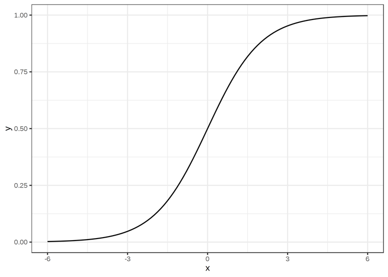

# cardio-vasc-risks

## Présentation du projet

## Veille informatique sur la régression logistique

### Définition:

La régression logistique est un **modèle statistique** permettant d'étudier les relations entre un ensemble de **variables qualitatives (X)** et une **variable qualitative binaire (Y)**.   
Il s'agit d'un **modèle linéaire** généralisé utilisant une **fonction logistique** comme fonction de lien.   

Un modèle de régression logistique permet aussi de **prédire la probabilité** qu'un événement se produise (valeur de 1) ou non (valeur de 0) à partir de l'**optimisation des coefficients de régression**.   
Ce résultat varie toujours entre 0 et 1. Lorsque la valeur prédite est supérieure à un seuil (0.5 par défaut), l'événement est prédit comme se produisant. Sinon, il est prédit comme ne se produisant pas.

### Mathématiquement:

Considérons un ensemble de données d'entrée X  definit comme suit:   
$$
X = {x_1, x_2, ..., x_n}
$$
La régression logistique a pour objectif de trouver une fonction h telle que nous puissions calculer:   

y = {1 si h(x) >= [seuil], 0 si h(x) < [seuil]}   

On comprend donc qu'on attend de notre fonction h qu'elle soit une probabilité comprise entre 0 et 1, paramétrée par = 1, 2, ..., n à optimiser et que le seuil que nous définissons correspond à notre critère de classification, généralement 0.5 .   

La fonction qui remplit le mieux ces conditions est la fonction sigmoïde, définit sur R à valeurs dans [0, 1]. Elle est définie comme suit:

$$
σ(x) = \frac{1}{1 + e^{-x}}
$$

Graphiquement, celle-ci correspond à une courbe en forme de S qui a pour limites 0 et 1 lorsque x tend vers -∞ et +∞ passant par y=0.5 lorsque x=0 .

